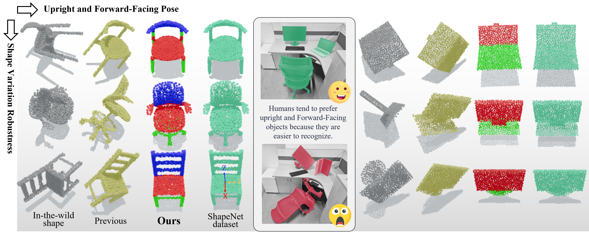
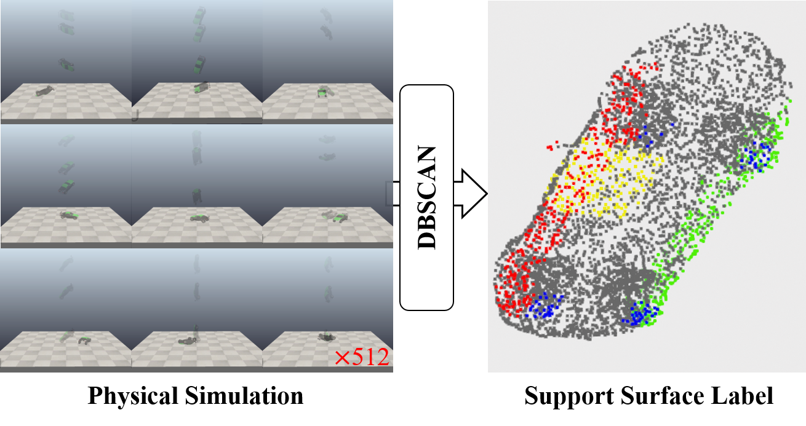
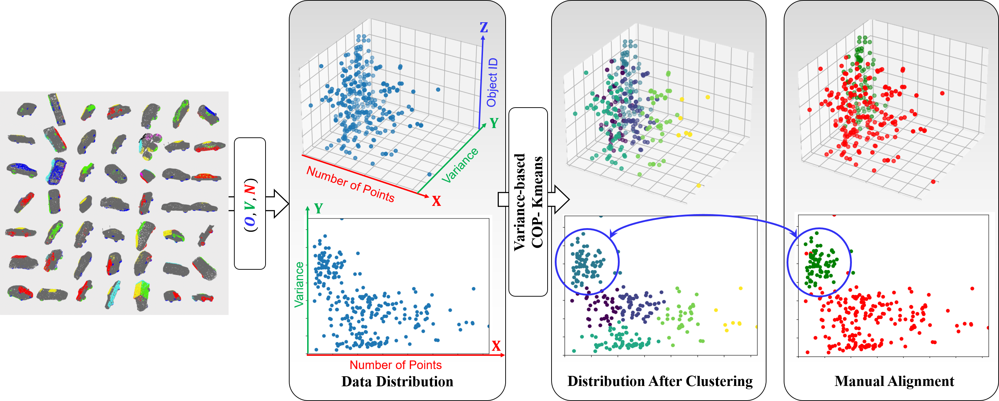

# Learning Upright and Forward-Facing Object Poses using Category-level Canonical Representations
We propose a category-level point cloud canonicalization method that learns a unified canonical pose across different instances within the same category.  We further extend this canonical pose to maintain an upright and forward-facing state. Our method eliminates the need for manually crafted object pose labels and effectively handles shape variations within categories, producing more consistent canonicalized outputs. 

- [Project Page](https://anon-mity.github.io/upright-facing/)
- [Data](https://drive.google.com/file/d/1RXZEHc7ZD_LlStugoKE7jiPE7T2Xs_b5/view?usp=drive_link)
- 

## Overview


## Usage
1.Download the ShapeNet dataset [here](https://condor-datasets.s3.us-east-2.amazonaws.com/dataset/ShapeNetAtlasNetH5_1024.zip) (Follow the data splitting of [ConDor](https://github.com/brown-ivl/ConDor) and [AtlasNet](https://github.com/TheoDEPRELLE/AtlasNetV2))
```python
# Create dataset directory
mkdir dataset
# Change directory
cd dataset
# Download the dataset (AtlasNet)
wget https://condor-datasets.s3.us-east-2.amazonaws.com/dataset/ShapeNetAtlasNetH5_1024.zip 
# Unzip the dataset
unzip ShapeNetAtlasNetH5_1024.zip
```

2.Training
```python
cd script
python train.py
```

<!--## Data generation
1.Physics Simulator
<div style="display: flex; justify-content: center; align-items: center;">
  
</div>

2.Cluster
<div style="text-align: center;">
  
</div>-->

## License
MIT License

## Acknowledgement
The structure of this codebase is borrowed from this pytorch implementataion of [VNN](https://github.com/FlyingGiraffe/vnn) and [Point-M2AE](https://github.com/ZrrSkywalker/Point-M2AE).

