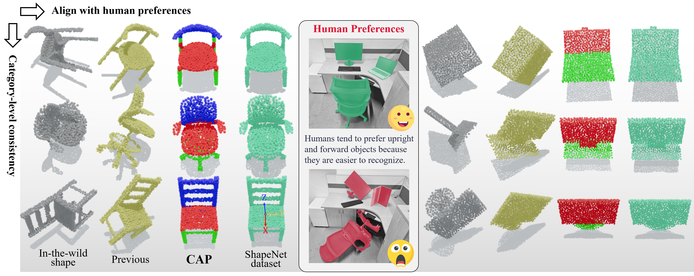

# CAP: Learning 3D Canonical Shape Representations Aligned with Human Preferences
We introduce Cap, a human-centric category-level point cloud canonicalization method that achieves SOTA consistency and aligns with human preferences. It exhibits improved physical significance, thereby driving numerous downstream tasks

- [Project Page](https://anonymity15333.github.io/CAP.github.io/)
- [Paper](https://anonymity15333.github.io/CAP.github.io/)
- [Data (coming soon...)](https://anonymity15333.github.io/CAP.github.io/)
  
## Overview

## Overview

## Acknowledgement
The structure of this codebase is borrowed from this pytorch implementataion of [VNN](https://github.com/FlyingGiraffe/vnn) 
