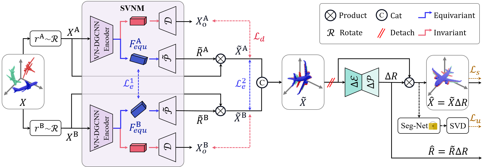

# CAP: Learning 3D Canonical Shape Representations Aligned with Human Preferences

We introduce Cap, a human-centric category-level point cloud canonicalization method. Built upon a Siamene SE(3)-equivariant architecture, Cap first disentangles shape and pose attributes through self-supervision. We then propose a Siamese equivariant constraint to mitigate pose misalignment caused by intra-class variations, thereby enhancing the consistency of canonical representations. Different from previous work, Cap learns a residual rotation to align the unbiased canonical representation with human understanding, leveraging both geometric priors and physical dynamics.

- [Project Page](https://anonymity15333.github.io/CAP.github.io/)
- [Paper](https://anonymity15333.github.io/CAP.github.io/)
- [Data (coming soon...)](https://anonymity15333.github.io/CAP.github.io/)
  
## Overview

